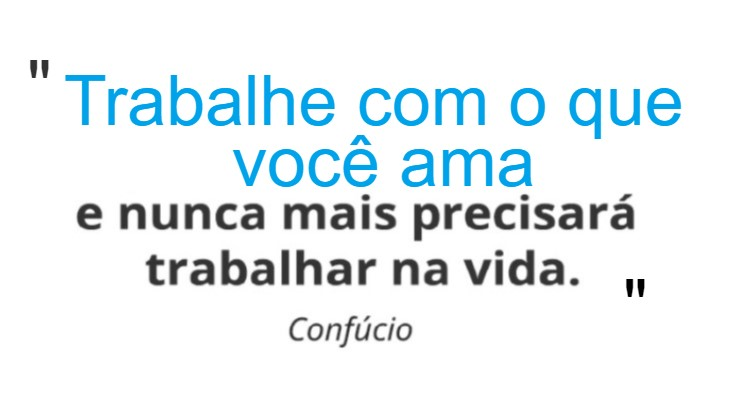

# Documentação!

## Link: [https://deybsonferreira.gitbook.io/detec/](https://deybsonferreira.gitbook.io/detec/)

### description: 'Documentação com dicas e melhores práticas para o aperfeiçoamento de códigos,'

## Documentação!

#### About myself , and about my codes!

códigos, tecnologias e ideias que acho interessante registrados durante minha experiência profissional como desenvolvedor Web.

Resolvi compartilhar, quem sabe te ajude também.

😁👍  
\#csharp \#javascript \#business \#database \#html \#web \#microsoft \#azure

### About myself 😁


**Name**: Deybson Ferreira : 25 anos

**email**: Deybson.10@hotmail.com

**Development**: Front , BackEnd WEB

**Freelancer**: projetos @DeTech



**Tags \* Conhecimentos**

C\# , Javascript, Html, Css , AngularJs, TypeScript, Java, C, API's.

Microsoft .Net Framework MVC / Microsoft .Net Core

Windows Form Application / Web Form Application

**Banco de dados** Sql server, Mysql 

Selenium, Ionic, Git Flow, Git Workflow

**IDE**: VisualStudio / VS Code


