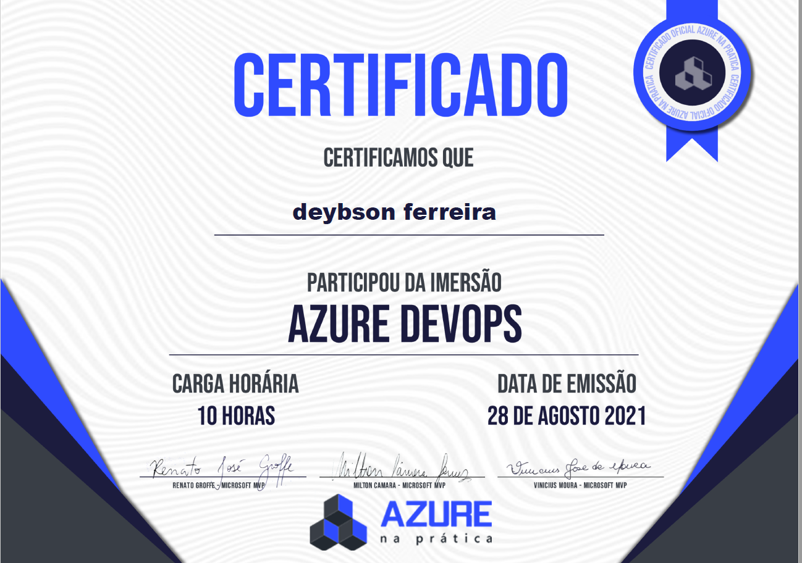
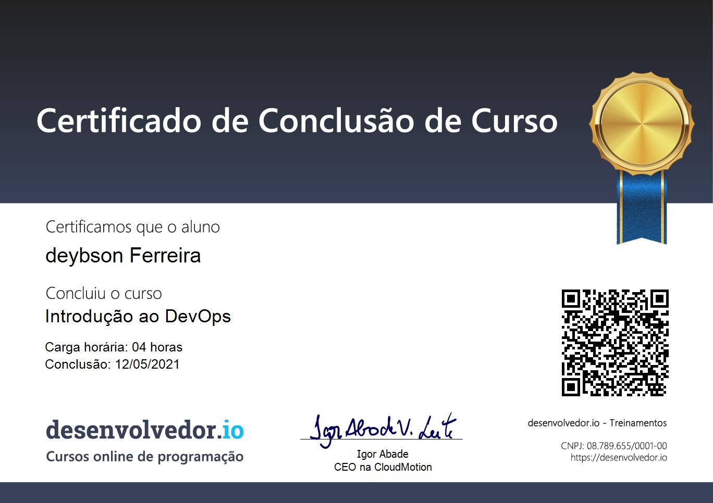
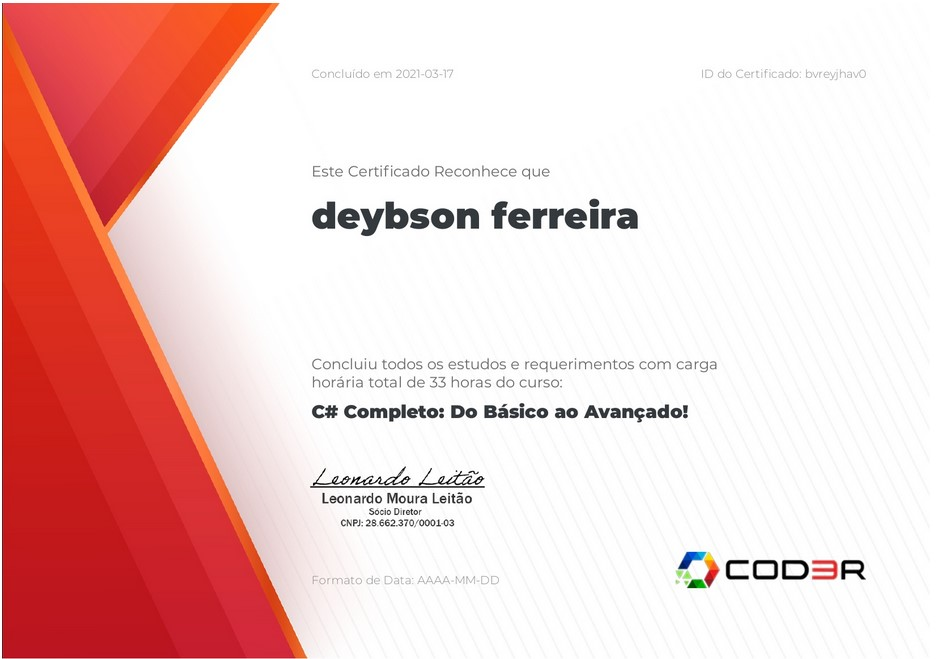
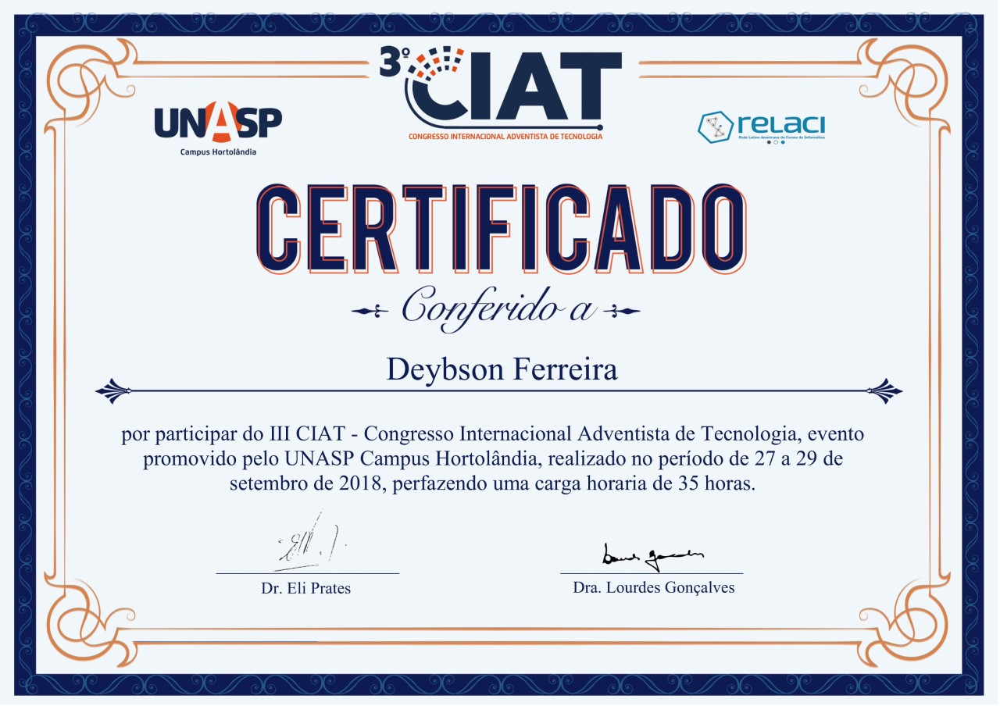

# Certificados \( Deybson Ferreira\)

## JavaScript Funcional / Fundamentos

## Intensivo Devops

## DevOps

## C\# 

## NodeJs

## Angular9



## Workshop : "Política da Segurança " - IATEC

## OKR

## Html, Css

## ASP NET MVC 5 C\#

## AngularJs

## Congresso Internacional Adventista de Tecnologia 2018

